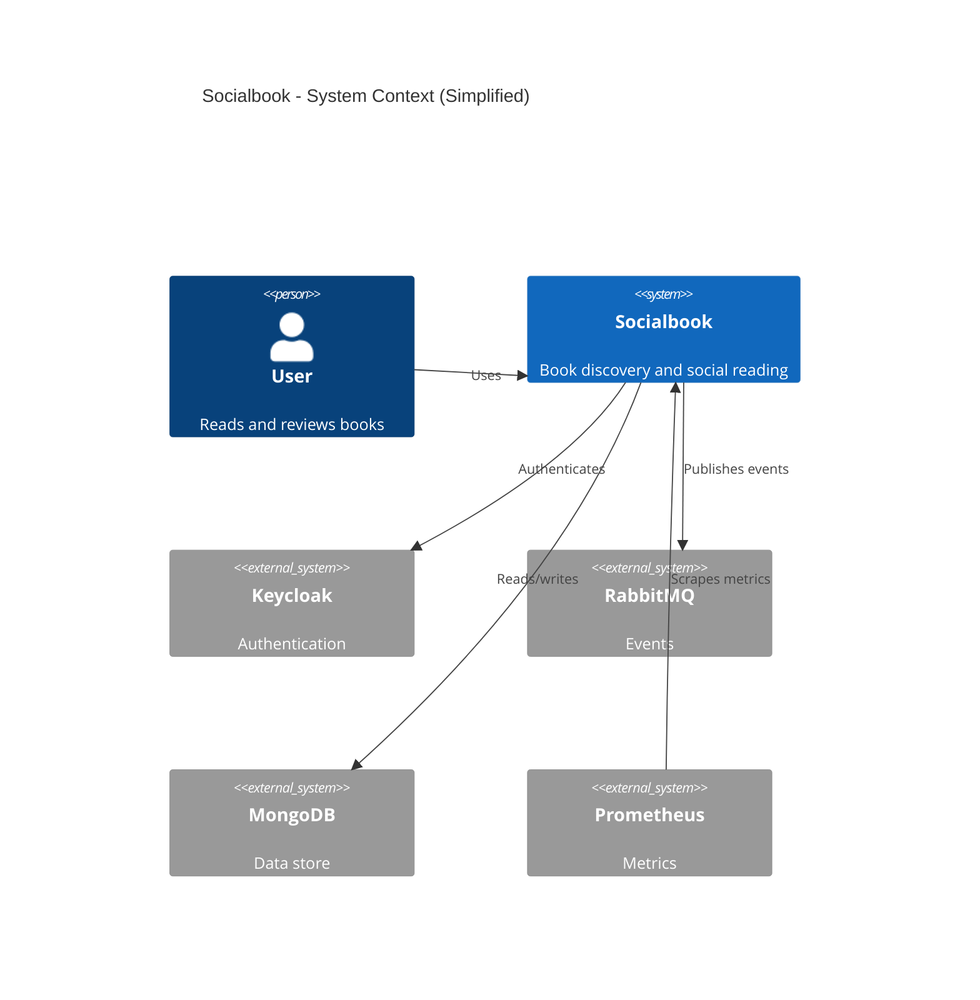
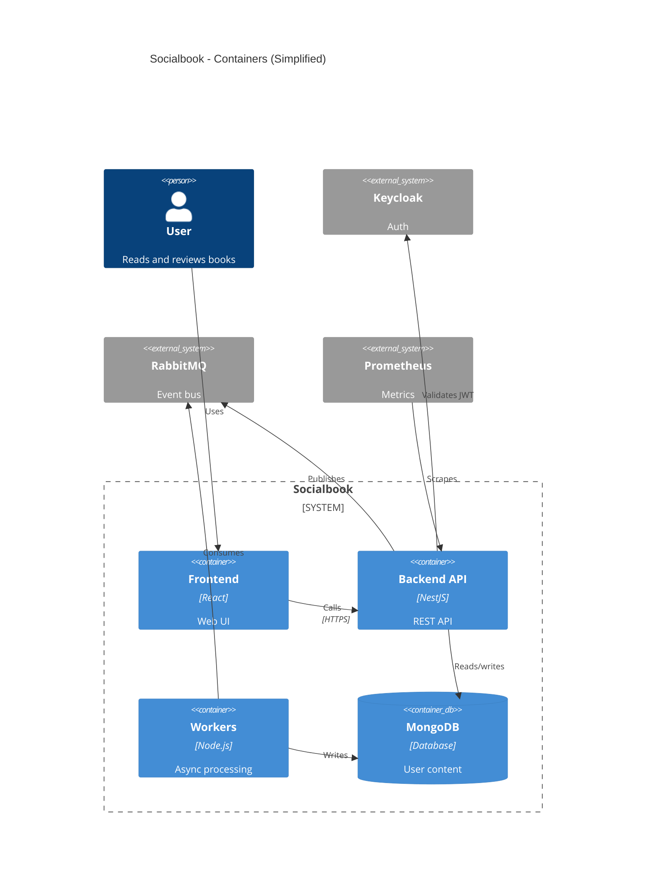

# C4 Model: Socialbook Architecture

```mermaid
C4Context
  title Socialbook - System Context (Simplified)

  Person(user, "User", "Reads and reviews books")

  System(socialbook, "Socialbook", "Book discovery and social reading")
  System_Ext(keycloak, "Keycloak", "Authentication")
  System_Ext(rabbitmq, "RabbitMQ", "Events")
  System_Ext(mongodb, "MongoDB", "Data store")
  System_Ext(prometheus, "Prometheus", "Metrics")

  Rel(user, socialbook, "Uses")
  Rel(socialbook, keycloak, "Authenticates")
  Rel(socialbook, rabbitmq, "Publishes events")
  Rel(socialbook, mongodb, "Reads/writes")
  Rel(prometheus, socialbook, "Scrapes metrics")
```

```mermaid
C4Container
  title Socialbook - Containers (Simplified)

  Person(user, "User", "Reads and reviews books")

  System_Boundary(socialbook, "Socialbook") {
    Container(frontend, "Frontend", "React", "Web UI")
    Container(api, "Backend API", "NestJS", "REST API")
    Container(worker, "Workers", "Node.js", "Async processing")
    ContainerDb(db, "MongoDB", "Database", "User content")
  }

  System_Ext(keycloak, "Keycloak", "Auth")
  System_Ext(rabbitmq, "RabbitMQ", "Event bus")
  System_Ext(prometheus, "Prometheus", "Metrics")

  Rel(user, frontend, "Uses")
  Rel(frontend, api, "Calls", "HTTPS")
  Rel(api, keycloak, "Validates JWT")
  Rel(api, db, "Reads/writes")
  Rel(api, rabbitmq, "Publishes")
  Rel(worker, rabbitmq, "Consumes")
  Rel(worker, db, "Writes")
  Rel(prometheus, api, "Scrapes")
```
